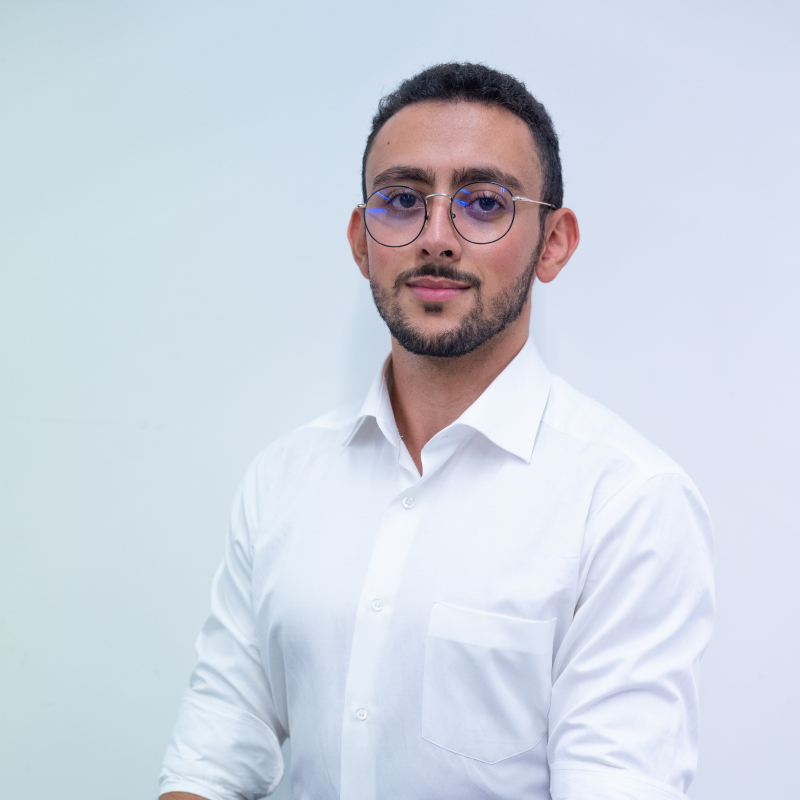

Mohamed Ait taleb

<i class="fa fa-envelope-o" aria-hidden="true"></i> [aittaleb@insa-toulouse.fr](mailto:aittaleb@insa-toulouse.fr) 

<i class="fa fa-linkedin" aria-hidden="true"></i> [linkedin.com/in/mohamed-aittaleb](https://www.linkedin.com/in/mohamed-aittaleb-84249325a/) 

<i class="fa fa-github" aria-hidden="true"></i> [Aitbytes](https://github.com/Aitbytes)

<i class="fa fa-phone"></i>+33 7 49 55 93 34 

<i class="fa fa-calendar" aria-hidden="true"></i> agé de **23 ans**

<i class="fa fa-home" aria-hidden="true"></i> 31400 Toulouse

## Compétences Techniques

- <u>**Infrastructure**</u> : Kubernetes, Docker, Terraform, Datadog, Linux, Git, Github actions, Ansible, GCP 
- <u>**Développement**</u> : Python, C, TypeScript/JavaScript  

- 
<i class="fa fa-square" aria-hidden="true"></i>  &gt;3 ans de pratique, ou certification

- 
<i class="fa fa-square" aria-hidden="true"></i> 1-3 ans de pratique

- 
<i class="fa fa-square" aria-hidden="true"></i> &lt;1 an de pratique

## Certifications
-  HashiCorp Certified: Terraform Associate (003)
-  Datadog Certified: Datadog Fundamentals

## Langues 

- **Français** (courant), **Anglais** (professionnel), **Arabe** (bilingue).

## Centres d'intérêt

- Passionné de **Musculation**, **Callisthénie**, Course à pied et **Randonnée**.
- **Improvisation**, **Éloquence**.

 ÉTUDIANT INGÉNIEUR INSA Toulouse
 **Consultant SecDevOps** en stage de fin d'études (équivalent M2). Recherche **CDI** à partir d'**octobre 2025** en DevOps, Infrastructure, ou SecDevOps 
<!-- 
 -->
<!---->
<!-- # Recherche -->
<!--  - **Stage** de **fin d'études** de **Mars à Septembre 2025**. -->
<!---->
<!-- 
 -->

## Formation

###  INSA Toulouse 
<location>Toulouse, France</location>  <time>Septembre 2020 - Présent</time>

- Diplôme d'Ingénieur **Informatique** et **Réseaux** prévu pour **Octobre 2025**
-   Spécialité **TLS-SEC** en cyber-sécurité en échange avec l'**INP ENSEEIHT**
-  **Double-diplôme** : **Master** Réseaux de Télécommunication spécialité **Sécurité de Systèmes d'Information et des Réseaux** à l'**Université de Toulouse** 

## Expériences 
### Samares Engineering, Blagnac, France 
#### Stage administrateur systéme <time>Juillet - Septembre 2024</time>
- **État des lieux**, Analyse des **riques**, et **conseil de remédiation**.
- Sécurisation de l'accès aux applications via **HTTPS** grace à un reverse proxy Traefik 
- Mise en place d'une **authentification centralisée** avec **Azure Entra ID**.
- Amélioration de la **fiabilité** et la **disponibilité** d'applications métier.

----------

### Confederation Nationale des Junior Entreprises, France 
#### Auditeur organisationel <time>Juillet 2024 - Présent</time>
- Audit de la Stratégie, du pilotage, du Développement commercial, de la Gestion de projets, et de la Gestion des ressources humaines.

----------

### Junior INSA Service, Toulouse, France 
#### Consultant <time>Avril 2024</time>

- **Cyber-sécurité** : Rédaction de politiques de sécurité en vue d'une certification ISO 27001

#### Vice-Président <time>Novembre 2023 - Présent</time>

- **Pilotage** : Gestion d'une équipe de 25 étudiants avec autonomie et rigeur.
- **Qualité** : Définition de processus et d'indicateurs pour l'obtention de la norme ISO 9001.
- **Communication** : Formation et évaluation des nouveaux membres.
- **Résolution de conflits** : Traitement des litiges clients, préservation de la structure contre des risques financiers.

#### Responsable développement commercial <time>Novembre 2022 - Novembre 2023</time>

- **Gestion de projets** : Pilôté avec succès quatres projets de développement web et mobile, garantissant la satisfaction client grâce à une adaptabilité et un sens de l'engagement.
- **Force de proposition technique** : Proposition de solutions techniques pour répondre aux besoins clients dans les propositions commerciales..

## Projets Académiques et Personnels

#### Moutons Fugueurs 
- Tentatice d'implémentation d'un système **IoT** de géolocalisation du bétail dans un environnement rural : État de l'art, développement sur **Arduino**, intégration de modules **GSM** et **GPS**.

#### Projet Qualité de Service dans les réseaux
- Implémentation d'un réseau opérateur utilisant la technologie **MPLS**, garantissant une isolation complète des clients et assurant la gestion de la **qualité de service**.

#### Projet "Home Server"
- Déploiement de services web à usage personel dans des conteneurs **docker**, avec une gestion de la **sécurité** : configuration de **firewalls**, de **reverse-proxys** et de l'accès via un **réseau** privé virtuel basé sur **Wiregard**.

